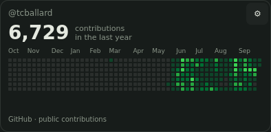

# GitHub Contributions

Your GitHub contribution calendar on the Omarchy desktop. A small, independently
installable Widget Core SDK consumer, with `tcballard` as its editable default.



Small shows the last 13 weeks and the annual total. Medium shows the complete
annual graph. Large splits that same year into two readable calendar panels.
Hover a day for its date and count, or focus the calendar and use arrow keys.
Choose GitHub green or your theme's accent. The settings include a copyable profile
URL. Zero contributions, loading, unavailable and stale data are distinct states.

## Try it

Requires the Core revision that adds `github-contributions`; older API 3 builds
reject this package with an upgrade message. It uses the advanced isolated QML
path because declarative v1 does not yet support charts or network data. The
package has no commands, credentials, direct HTTP or private filesystem storage.

From the matching Core checkout on Omarchy:

```bash
bash install-local --update
omarchy-widget install ./widgets/github-contributions
omarchy-widget github-permission io.github.tcballard.github-contributions allow
omarchy-widget add io.github.tcballard.github-contributions
```

Use `bash install-local` for a first Core install. To update an existing widget,
use `omarchy-widget update ./widgets/github-contributions`, then grant access
again for the new installed version. The manager's Add widgets tab also offers
Allow/Revoke GitHub access. Configure the username and colours with the gear.
Normal Core Add, Duplicate, Hide/Show, size, workspace and removal controls apply.

## Data and limits

Core fetches `https://github.com/users/USERNAME/contributions` without signing in.
The request shares the configured username and your IP address with GitHub.
This is GitHub's public calendar fragment, **not a documented stable API**.
Changed or incomplete markup fails closed rather than inventing a calendar.
Only dates, counts and intensity levels cross the broker into this widget.
Public totals can differ from your signed-in graph, especially for private activity.
No third-party contribution service or token is used.

Core caches public results in memory for 15 minutes and shares them across
permitted instances. Hidden widgets cannot start a fetch. Offline refresh retains
the last known graph and labels it stale; restarting Core clears the cache.
Removing or updating a package invalidates its grant. Revocation prevents future
broker reads; it cannot recall data already shown in a renderer.

## Evidence

The bundled previews were rendered from this widget's actual QML with a public
`tcballard` response captured on **5 October 2026 (6,729 contributions)**. They are
offscreen Qt captures, not live Omarchy desktop screenshots. They intentionally
do not reproduce the supplied signed-in screenshot's 7,076 total.

Portable verification covers full and partial weeks, exact calendar coverage,
invalid usernames/dates/markup, generation permissions, hidden request gating,
all sizes, keyboard-ready cells, settings validation, theme colours and data states.
The production HTTP transport and real desktop focus, hover, suspend/resume,
workspace switching and installed sandbox still need XPS acceptance. See
[the Core integration notes](../../docs/github-contributions.md).

MIT licensed. GitHub is a trademark of GitHub, Inc.; this is an unofficial widget.
